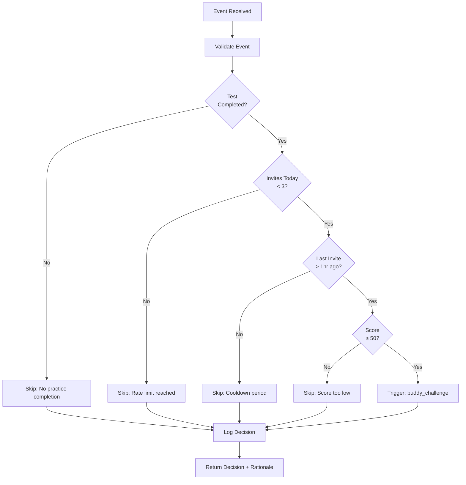

# Product Requirements Document: Loop Orchestrator Agent

**Version:** 1.0  
**Date:** 2025-01-21  
**Feature:** MVP Feature 3.2  
**Status:** Ready for Implementation

---

## 1. Overview

### 1.1 Feature Description
The Loop Orchestrator Agent is an AI decision-making agent that determines when to trigger viral loop prompts based on user eligibility, rate limits, and contextual factors. It acts as the "brain" of the viral growth system, ensuring prompts are shown at the right time to the right users while preventing spam and abuse.

### 1.2 Goals
- Make intelligent, contextual decisions about when to show viral loop prompts
- Prevent spam and abuse through rate limiting
- Ensure optimal timing for maximum conversion
- Provide full auditability through decision logging
- Demonstrate agent-oriented architecture pattern

### 1.3 Success Metrics
- **Decision Accuracy**: >95% of triggered invites result in share action (user clicks "Challenge Friend")
- **Response Time**: <150ms decision latency (per requirements)
- **Rate Limit Effectiveness**: <0.5% spam/fraud rate
- **Auditability**: 100% of decisions logged with rationale

---

## 2. Architecture

### 2.1 Agent Pattern

The Loop Orchestrator is implemented as a TypeScript class that:
- Takes context (user, event) as input
- Applies decision logic (rules-based for MVP)
- Returns structured decision with rationale
- Logs all decisions for auditability

**Interface:**
```typescript
interface AgentDecision {
  shouldTrigger: boolean;
  rationale: string;
  loopType?: string;
  features_used: string[];
  confidence?: number;        // Optional for future ML models
}

interface OrchestratorAgent {
  decide(userId: string, event: Event): Promise<AgentDecision>;
  logDecision(decision: AgentDecision, context: DecisionContext): Promise<void>;
}
```

### 2.2 Decision Flow



---

## 3. Decision Logic Specifications

### 3.1 Eligibility Rules

#### Rule 1: Practice Test Completion
**Check:** User must have completed a practice test
**Implementation:**
```typescript
const practiceResult = await getPracticeResult(event.resultId);
if (!practiceResult || !practiceResult.completed_at) {
  return {
    shouldTrigger: false,
    rationale: "No practice test completion found",
    features_used: ["practice_completion_check"]
  };
}
```

#### Rule 2: Rate Limiting (Daily Limit)
**Check:** User must have sent fewer than 3 invites today
**Threshold:** 3 invites per day (hard limit)
**Implementation:**
```typescript
const invitesToday = await getInviteCountToday(userId);
if (invitesToday >= 3) {
  return {
    shouldTrigger: false,
    rationale: `User has sent ${invitesToday}/3 invites today (rate limit reached)`,
    features_used: ["invite_count_today"]
  };
}
```

**Rationale:** Prevents spam and ensures users don't overwhelm their friends with invites.

#### Rule 3: Cooldown Period
**Check:** Last invite must have been sent more than 1 hour ago
**Threshold:** 1 hour minimum between invites
**Implementation:**
```typescript
const lastInvite = await getLastInviteTime(userId);
const hoursSinceLastInvite = (Date.now() - lastInvite) / (1000 * 60 * 60);

if (hoursSinceLastInvite < 1) {
  return {
    shouldTrigger: false,
    rationale: `Last invite sent ${Math.round(hoursSinceLastInvite * 60)}m ago (1hr cooldown required)`,
    features_used: ["last_invite_timestamp"]
  };
}
```

**Rationale:** Prevents users from sending multiple invites in quick succession, which can feel spammy.

#### Rule 4: Score Threshold
**Check:** Practice test score must be ≥50%
**Threshold:** Minimum 50% score
**Implementation:**
```typescript
const score = practiceResult.score;
if (score < 50) {
  return {
    shouldTrigger: false,
    rationale: `Score too low (${score}%), may discourage sharing`,
    features_used: ["practice_score"]
  };
}
```

**Rationale:** Users with very low scores may feel embarrassed to share. This threshold ensures only reasonably successful attempts trigger invites.

### 3.2 Combined Decision Logic

**Full Decision Tree:**
```
IF practice_completed = true
  AND invites_today < 3
  AND last_invite > 1 hour ago
  AND score >= 50
THEN trigger "buddy_challenge"
ELSE skip
```

**Trigger Decision Example:**
```typescript
{
  shouldTrigger: true,
  rationale: "User scored 78% on practice test, 1/3 invites used today, last invite 2 hours ago",
  loopType: "buddy_challenge",
  features_used: [
    "practice_completion_check",
    "practice_score",
    "invite_count_today",
    "last_invite_timestamp"
  ]
}
```

**Skip Decision Example:**
```typescript
{
  shouldTrigger: false,
  rationale: "User has sent 3/3 invites today (rate limit reached)",
  features_used: ["invite_count_today"]
}
```

---

## 4. Decision Logging

### 4.1 Log Structure

Every decision must be logged to the `decisions` collection with:

```typescript
{
  id: string;                 // Auto-generated
  user_id: string;           // User who triggered the event
  event_type: string;        // "practice_completed"
  event_id: string;          // ID of the practice result
  decision: string;          // "trigger_buddy_challenge" | "skip"
  rationale: string;          // Human-readable explanation
  features_used: string[];   // Features/checks that influenced decision
  context: {
    score?: number;
    invites_today?: number;
    last_invite_hours_ago?: number;
  };
  created_at: timestamp;     // When decision was made
}
```

### 4.2 Logging Implementation

**Synchronous Logging:**
```typescript
async logDecision(decision: AgentDecision, context: DecisionContext): Promise<void> {
  await db.decisions.create({
    userId: context.userId,
    eventType: context.eventType,
    eventId: context.eventId,
    decision: decision.shouldTrigger ? `trigger_${decision.loopType}` : "skip",
    rationale: decision.rationale,
    featuresUsed: decision.features_used,
    context: {
      score: context.score,
      invites_today: context.invitesToday,
      last_invite_hours_ago: context.hoursSinceLastInvite
    },
    createdAt: new Date()
  });
}
```

**Why Synchronous:**
- Ensures all decisions are logged (no data loss)
- Critical for auditability and debugging
- Small performance cost (<50ms) acceptable for MVP

### 4.3 Audit Trail Use Cases

**Debugging:**
- Why wasn't invite shown to user X?
- Query: `decisions.where('user_id', '=', userId).where('decision', '==', 'skip')`

**Analytics:**
- How many decisions were skips vs triggers?
- Query: Aggregate decisions by `decision` field

**Compliance:**
- Can explain why any user did or didn't see an invite
- Full history of all eligibility checks

---

## 5. API Specifications

### 5.1 Internal Endpoint: POST `/api/orchestrator/decide`

**Purpose:** Make decision about whether to trigger viral loop

**Called By:**
- `POST /api/invite/create` (when user clicks "Challenge Friend" button)

**Note:** Orchestrator is NOT called during practice completion. It runs when user explicitly requests to create an invite, ensuring decision happens at the right moment.

**Request:**
```typescript
{
  userId: string;
  event: {
    type: "practice_completed";
    resultId: string;
    score: number;
    skillGaps: string[];
  };
}
```

**Response:**
```typescript
{
  shouldTrigger: boolean;
  rationale: string;
  loopType?: string;           // "buddy_challenge" if shouldTrigger = true
  features_used: string[];
  decisionId: string;           // ID of logged decision for reference
}
```

**Response Time:** <150ms (per requirements)

**Error Handling:**
- User not found → 404
- Event invalid → 400
- Database error → 500 (retry logic)

### 5.2 Integration with Invite Creation Flow

**Flow:**
```
1. User completes practice test
   ↓
2. POST /api/practice/complete called
   ↓
3. Practice result saved to database
   ↓
4. Returns: { resultId, score, skillGaps, shouldShowInvite }
   ↓
5. Results page shows "Challenge Friend" button (if shouldShowInvite = true)
   ↓
6. User clicks "Challenge Friend" button
   ↓
7. POST /api/invite/create called
   ↓
8. POST /api/orchestrator/decide called internally (final check)
   ↓
9. Orchestrator:
   a. Fetches user invite history
   b. Applies decision logic
   c. Logs decision
   d. Returns decision
   ↓
10. If shouldTrigger = true:
    - Generate challenge (Session Intelligence)
    - Create invite record
    - Return shareLink
   ↓
11. If shouldTrigger = false:
    - Return error with user-friendly message
    - Show error to user
```

---

## 6. Performance Requirements

### 6.1 Response Time Targets

| Operation | Target | Notes |
|-----------|--------|-------|
| Decision calculation | <100ms | Pure logic, no I/O |
| Database queries | <50ms | Fetch invite count, last invite time |
| Decision logging | <50ms | Write to decisions collection |
| **Total response time** | **<150ms** | **Per requirements** |

### 6.2 Optimization Strategies

**Caching:**
- Cache user invite counts for today (refresh every 5 minutes)
- Cache last invite timestamp (refresh on new invite)

**Database Indexes:**
- Index `invites.inviter_id` + `created_at` for fast today's count query
- Index `decisions.user_id` + `created_at` for audit trail queries

**Query Optimization:**
- Fetch invite count and last invite time in single query (or parallel)
- Use Firestore aggregation queries when possible

### 6.3 Scalability Considerations

**Current (MVP):**
- Synchronous decision logging
- Direct database queries
- In-memory agent instance

**Future (Production):**
- Async decision logging (fire-and-forget)
- Redis cache for invite counts
- Batch decision processing
- ML models for more sophisticated decisions

---

## 7. Error Handling & Graceful Degradation

### 7.1 Failure Scenarios

#### Scenario 1: Database Query Fails
**Situation:** Can't fetch invite count or last invite time

**Handling:**
- Default to conservative decision (skip)
- Log error with decision
- Return: `{ shouldTrigger: false, rationale: "Unable to verify eligibility (system error)" }`

**Rationale:** Better to skip than to show invite inappropriately.

#### Scenario 2: Decision Logging Fails
**Situation:** Can't write decision to database

**Handling:**
- Log to application logs as backup
- Still return decision (don't block user flow)
- Alert monitoring system
- Retry logging async

**Rationale:** User experience takes priority over auditability, but we still track in logs.

#### Scenario 3: Agent Class Initialization Fails
**Situation:** Orchestrator agent can't be instantiated

**Handling:**
- Fallback to default decision logic (simple rule-based)
- Log error
- Alert monitoring system

**Rationale:** System should degrade gracefully, not crash.

### 7.2 Default Fallback Behavior

**If Orchestrator completely fails:**
- Default to: `shouldTrigger: false`
- Log: "Orchestrator agent failed, defaulting to skip"
- Show default copy if needed: "Challenge a Friend" (but don't enforce rate limits)

---

## 8. Testing Requirements

### 8.1 Unit Tests

**Test Cases:**

1. **All Rules Pass → Trigger**
   - Practice completed ✅
   - Invites today: 0/3 ✅
   - Last invite: 2 hours ago ✅
   - Score: 78% ✅
   - Expected: `shouldTrigger: true`

2. **Rate Limit Reached → Skip**
   - Practice completed ✅
   - Invites today: 3/3 ❌
   - Expected: `shouldTrigger: false, rationale: "rate limit reached"`

3. **Cooldown Period → Skip**
   - Practice completed ✅
   - Invites today: 1/3 ✅
   - Last invite: 30 minutes ago ❌
   - Expected: `shouldTrigger: false, rationale: "cooldown period"`

4. **Low Score → Skip**
   - Practice completed ✅
   - Invites today: 0/3 ✅
   - Score: 45% ❌
   - Expected: `shouldTrigger: false, rationale: "score too low"`

5. **No Practice Completion → Skip**
   - Practice not completed ❌
   - Expected: `shouldTrigger: false, rationale: "no practice completion"`

### 8.2 Integration Tests

**Test Scenarios:**

1. **End-to-End Decision Flow**
   - Mock practice completion
   - Call orchestrator
   - Verify decision logged
   - Verify UI shows/hides button correctly

2. **Database Query Performance**
   - Test invite count query with large dataset
   - Verify <50ms response time
   - Test with missing indexes (should fail gracefully)

3. **Concurrent Decision Requests**
   - Multiple users completing tests simultaneously
   - Verify no race conditions
   - Verify accurate rate limiting

### 8.3 Acceptance Criteria

✅ **Decision Logic:**
- All rules correctly evaluated
- Correct boolean returned (trigger/skip)
- Rationale accurately explains decision

✅ **Rate Limiting:**
- 3/day limit enforced correctly
- Cooldown period enforced correctly
- Counts reset at midnight (or configured time)

✅ **Logging:**
- 100% of decisions logged
- All required fields present
- Timestamps accurate
- Queryable for debugging

✅ **Performance:**
- <150ms response time (p95)
- Handles 50 concurrent requests
- No memory leaks

✅ **Error Handling:**
- Graceful degradation on failures
- No user-facing errors
- Errors logged appropriately

---

## 9. Future Enhancements

**Phase 2 - ML Integration:** Train model on conversion data, predict sharing likelihood (score patterns, time/day, subject, engagement), confidence scores

**Phase 3 - Personalization:** Adjust thresholds per user (60% avg → 55% threshold, 90% avg → 80% threshold)

**Phase 3 - A/B Testing:** Test rate limits (2/3/5 per day), score thresholds (40/50/60%), cooldowns (30min/1hr/2hr), measure K-factor impact

**Phase 4 - Multi-Loop:** Decide which loop (Buddy Challenge vs Streak Rescue vs Achievement), prioritize by context, prevent multiple prompts

---

## 10. Dependencies

**Internal:** Firestore (invite history, decision logs), Practice Results (completion data), User Data (ID, invite history)  
**External:** None (pure logic)

---

## 11. Risks, Monitoring & Mitigations

**Technical Risks:** Latency >150ms (optimize queries, cache, monitor), rate limit race conditions (transactions, concurrent tests), log growth (archive >90 days)  
**Product Risks:** Too restrictive (monitor skip rate, adjust thresholds, A/B test), too permissive (monitor fraud, tighten limits), unclear UI (future tooltips, logged decisions)

**Key Metrics:** Trigger/skip rates, decision latency (p50/p95/p99), conversion rate, error rate  
**Alerts:** Critical (latency >200ms, error >1%), Warning (skip rate >80%, trigger rate <10%)

---

**Document Status:** Ready for Implementation  
**Last Updated:** 2025-01-21  
**Related Documents:** PRD_MVP.md, PRD_viral_loop.md

