# System Architecture
## 10x K-Factor Viral Growth System - MVP

**Version:** 1.0  
**Date:** 2025-01-21

---

## Architecture Overview

This document describes the system architecture for the MVP viral growth system. The architecture prioritizes simplicity, speed of development, and clear separation of concerns while demonstrating the agent-oriented thinking required by the project.

---

## High-Level Architecture

```mermaid
graph TB
    subgraph "Frontend Layer"
        UI[Next.js App<br/>TypeScript + Tailwind CSS]
        P1[/practice<br/>Practice Test]
        P2[/results/:id<br/>Results Page]
        P3[/invite/:code<br/>Challenge Landing]
        P4[/challenge/:id<br/>Take Challenge]
        P5[/analytics<br/>K-Factor Dashboard]
    end
    
    subgraph "API Layer - Next.js API Routes"
        API[API Router]
        ORCH[Loop Orchestrator Agent]
        SESSION[Session Intelligence]
        ATTR[Attribution Service]
        REWARD[Reward Service]
    end
    
    subgraph "Data Layer"
        DB[(Firebase Firestore)]
        USERS[users Collection]
        RESULTS[practice_results Collection]
        INVITES[invites Collection<br/>challenge_data embedded]
        DECISIONS[decisions Collection]
        COUNTERS[analytics_counters<br/>Pre-calculated metrics]
    end
    
    UI --> P1 & P2 & P3 & P4 & P5
    P1 & P2 & P3 & P4 & P5 -->|HTTP| API
    API --> ORCH & SESSION & ATTR & REWARD
    ORCH -->|Log Decisions| DECISIONS
    SESSION -->|Store Challenges| CHALLENGES
    ATTR -->|Track Invites| INVITES
    REWARD -->|Update Users| USERS
    API -->|Query/Write| DB
    DB --> USERS & RESULTS & INVITES & DECISIONS & CHALLENGES
```

---

## Component Architecture

### Frontend Components

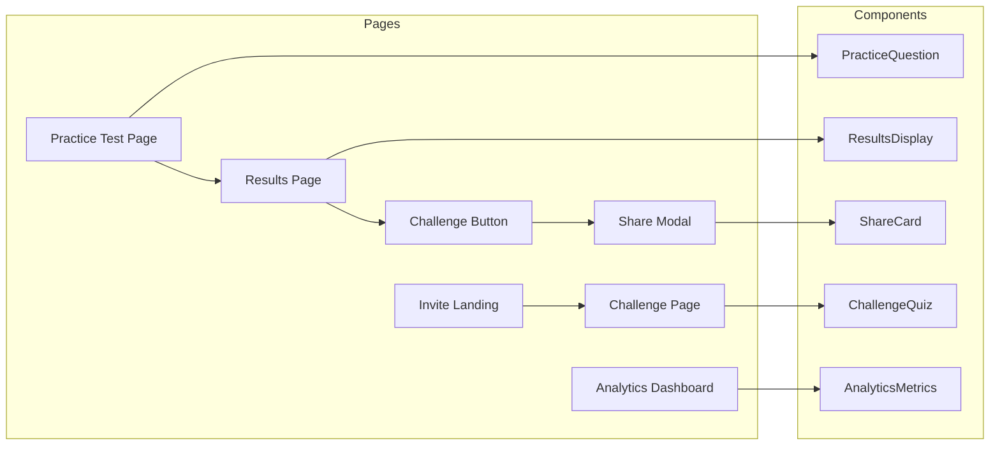

---

## Data Flow Architecture

### Complete Viral Loop Flow

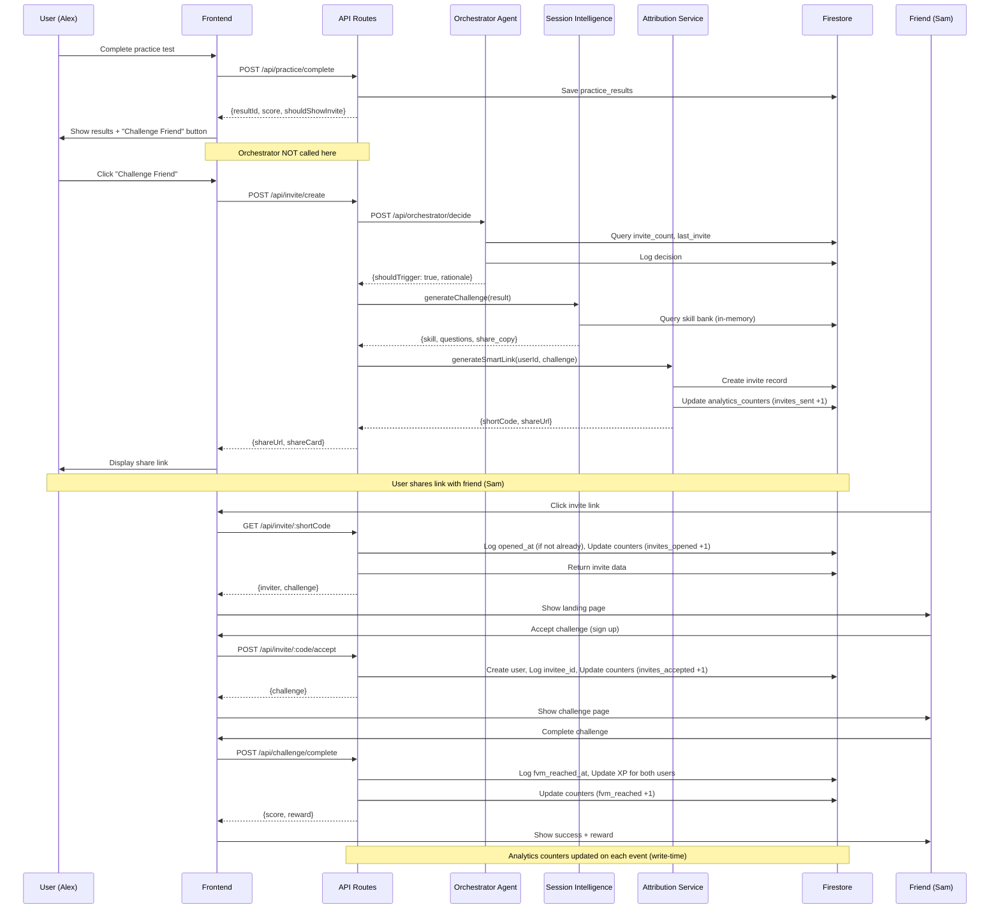

---

## Agent Architecture

### Loop Orchestrator Agent

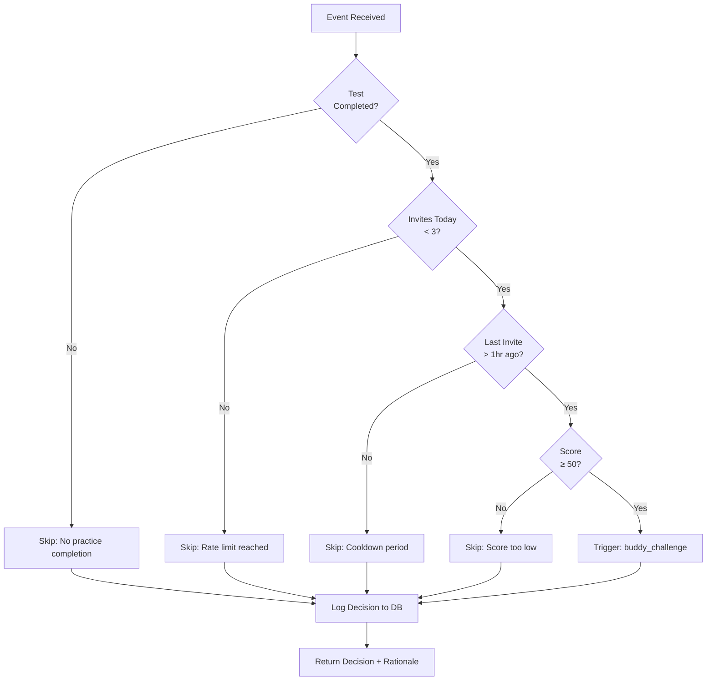

### Decision Logging Structure

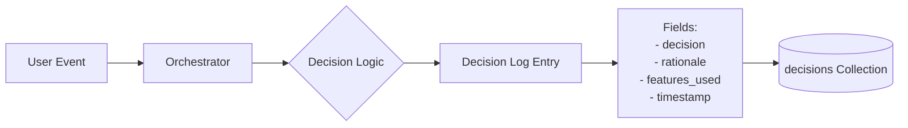

---

## Database Schema

### Entity Relationship Diagram

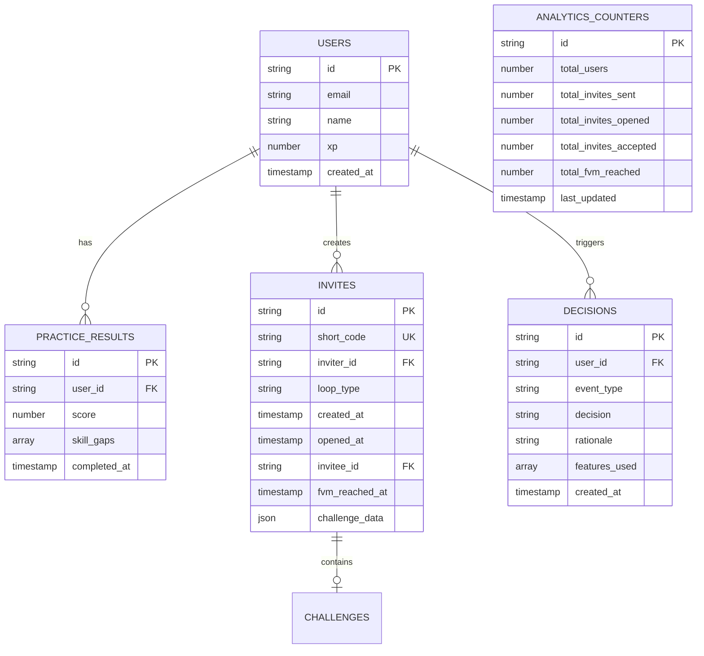

---

## API Architecture

### API Endpoint Map

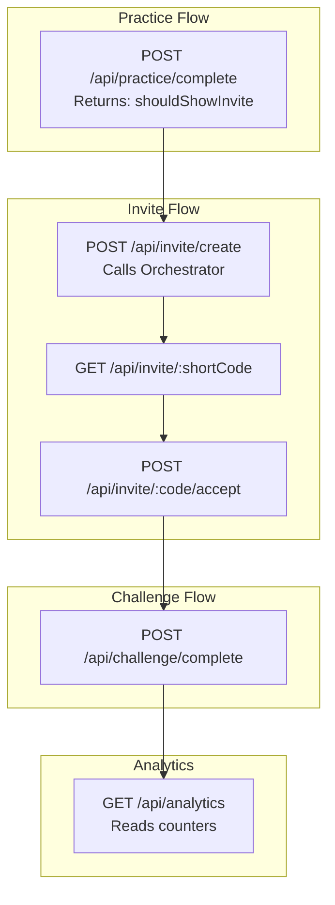

---

## Attribution Flow

### Smart Link Tracking

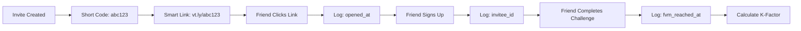

---

## K-Factor Calculation Flow (Pre-Calculated Counters)

### Analytics Pipeline

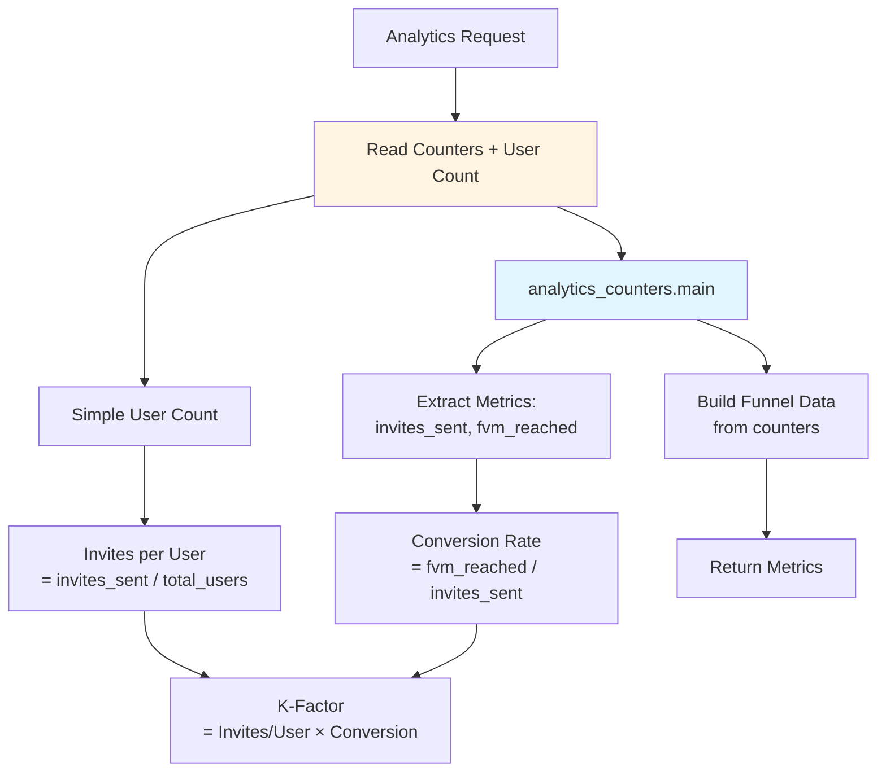

---

## Technology Stack Details

### Frontend Stack

```
┌─────────────────────────────────────┐
│  Next.js 14+ (App Router)           │
│  ├─ TypeScript                      │
│  ├─ Tailwind CSS                    │
│  ├─ React Hook Form                 │
│  └─ Client-Side Routing             │
└─────────────────────────────────────┘
```

### Backend Stack

```
┌─────────────────────────────────────┐
│  Next.js API Routes                 │
│  ├─ TypeScript                      │
│  ├─ Agent Classes                   │
│  │  ├─ Loop Orchestrator           │
│  │  └─ Session Intelligence        │
│  └─ Service Modules                 │
│     ├─ Attribution Service          │
│     └─ Reward Service               │
└─────────────────────────────────────┘
```

### Data Stack

```
┌─────────────────────────────────────┐
│  Firebase Firestore                 │
│  ├─ Collections                     │
│  │  ├─ users                       │
│  │  ├─ practice_results            │
│  │  ├─ invites                     │
│  │  ├─ decisions                   │
│  │  └─ challenges                  │
│  └─ Indexes                         │
│     ├─ invites by short_code        │
│     └─ invites by inviter_id        │
└─────────────────────────────────────┘
```

---

## Agent Communication Pattern

### MCP-Inspired Architecture (Simplified for MVP)

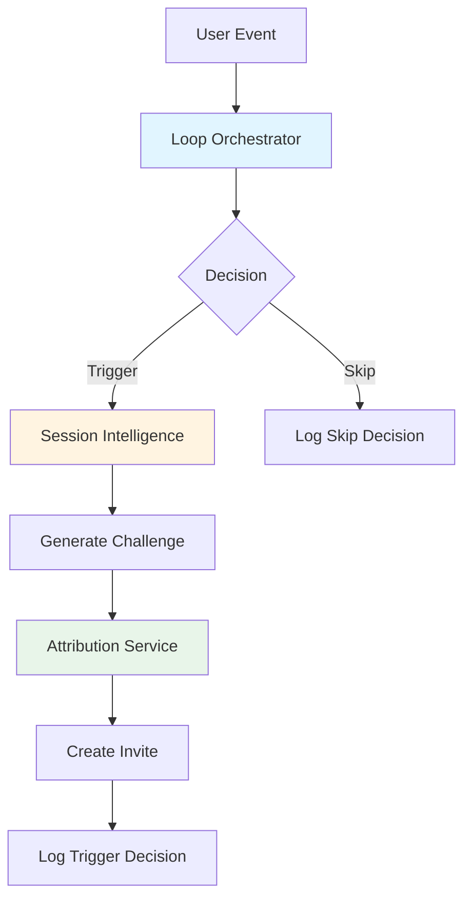

**Note:** Full MCP protocol with JSON schemas is planned for future phases. MVP uses simplified TypeScript interfaces.

### Agent Interface

```typescript
interface AgentDecision {
  shouldTrigger: boolean;
  rationale: string;
  loopType?: string;
  features_used: string[];
}

interface Agent {
  decide(context: AgentContext): Promise<AgentDecision>;
  logDecision(decision: AgentDecision): Promise<void>;
}
```

---

## Error Handling & Graceful Degradation

### Fallback Strategy

```mermaid
graph TD
    TRY[Try Agent Decision] --> SUCCESS{Success?}
    SUCCESS -->|Yes| USE[Use Agent Result]
    SUCCESS -->|No| FALLBACK[Use Default]
    
    FALLBACK --> DEFAULT_COPY[Default Copy:<br/>"Challenge a Friend!"]
    FALLBACK --> DEFAULT_QUESTIONS[Generic Questions<br/>from Skill Bank]
    
    USE --> CONTINUE[Continue Flow]
    DEFAULT_COPY --> CONTINUE
    DEFAULT_QUESTIONS --> CONTINUE
```

---

## Security Architecture

### Privacy & Safety Layers

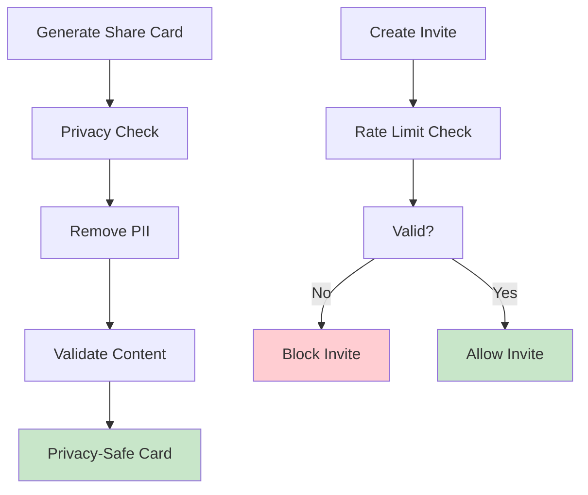

---

## Deployment Architecture

### Vercel Deployment

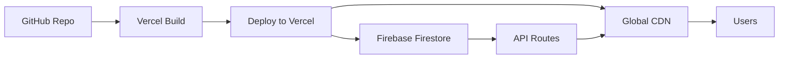

---

## Performance Considerations

### Response Time Targets

| Component | Target | Notes |
|-----------|--------|-------|
| Orchestrator Decision | <150ms | Required by spec |
| API Response (p95) | <500ms | Excluding Orchestrator |
| Smart Link Resolution | <500ms | Database query + redirect |
| Analytics Query | <1s | Firestore aggregation |

### Optimization Strategies

- **Database Indexes**: Index `short_code`, `inviter_id`, `created_at` for fast queries
- **Caching**: Cache skill bank questions in memory
- **Lazy Loading**: Load challenge questions only when needed
- **Batch Operations**: Batch reward updates when possible

---

## Scalability Considerations (Future)

### Current (MVP)
- Single-region deployment
- No caching layer
- Direct Firestore queries
- Mock authentication

### Future (Production)
- Multi-region deployment
- Redis caching layer
- Firestore with Cloud Functions for heavy operations
- Firebase Auth with SSO
- Message queue for async operations
- Real-time presence via WebSockets

---

## Monitoring & Observability

### Logging Strategy

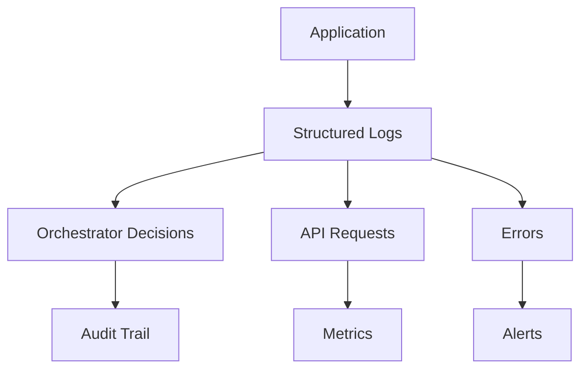

### Key Metrics to Track

1. **Orchestrator Metrics**
   - Decision latency (p50, p95, p99)
   - Trigger rate vs skip rate
   - Feature usage frequency

2. **Viral Loop Metrics**
   - Invites sent per user
   - Conversion rate at each funnel stage
   - K-factor by time period

3. **System Health**
   - API error rates
   - Database query performance
   - User experience metrics (time to FVM)

---

## Architecture Decisions

### Why Next.js API Routes (not Cloud Functions)?

**Decision:** Use Next.js API Routes for backend logic.

**Rationale:**
- No cold starts (<50ms response time vs 2-5s for Cloud Functions)
- Agents can be TypeScript classes held in memory
- Simpler local development (no emulators needed)
- Single repo for frontend + backend
- Easier debugging and testing

**Trade-offs:**
- Less "serverless" (but still scalable on Vercel)
- Less automatic scaling (but fine for MVP)

### Why Firebase Firestore (not Postgres/Supabase)?

**Decision:** Use Firestore for database.

**Rationale:**
- Developer familiarity (faster MVP)
- Real-time subscriptions ready for future features
- Serverless scaling
- Simple schema for MVP needs

**Trade-offs:**
- Complex analytics queries harder (but MVP metrics are simple)
- Can migrate to Supabase later if needed
- Vendor lock-in (acceptable for MVP)

### Why Single Agent (Orchestrator) in MVP?

**Decision:** Build only Loop Orchestrator agent in MVP.

**Rationale:**
- Demonstrates agent architecture pattern
- Most foundational (controls all loops)
- Clean decision logging shows auditability
- Can add more agents later

**Trade-offs:**
- No personalization (same copy for everyone - fine for MVP)
- No A/B testing (manual allocation later if needed)
- Simpler system = faster delivery

### Why Buddy Challenge Loop Only?

**Decision:** Build only Buddy Challenge viral loop in MVP.

**Rationale:**
- Simplest to implement (student → student, no parent/tutor complexity)
- Clear trigger (practice test completion)
- Measurable K-factor
- Self-contained (no real-time coordination needed)

**Trade-offs:**
- Only one loop (but proves the concept)
- Can add more loops after MVP

---

## Future Architecture Evolution

### Phase 2: Multi-Agent System

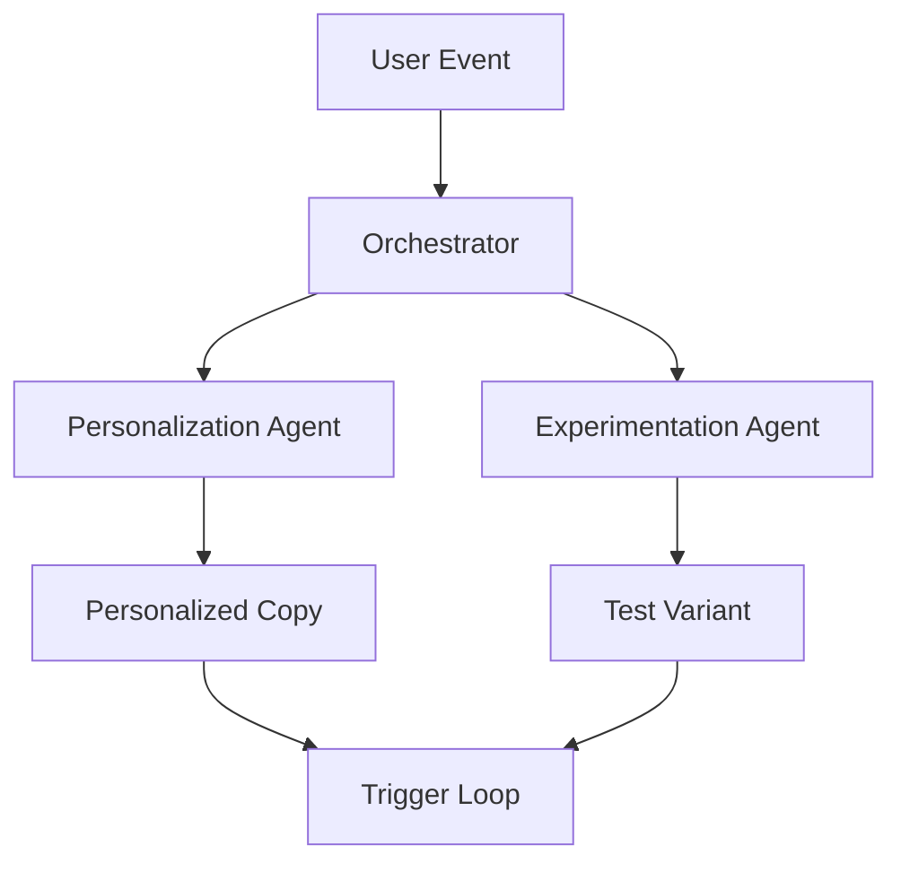

### Phase 3: Real-Time Features

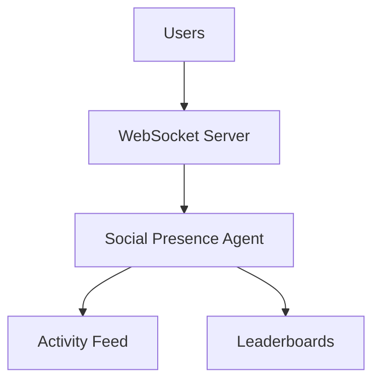

### Phase 4: Full MCP Protocol

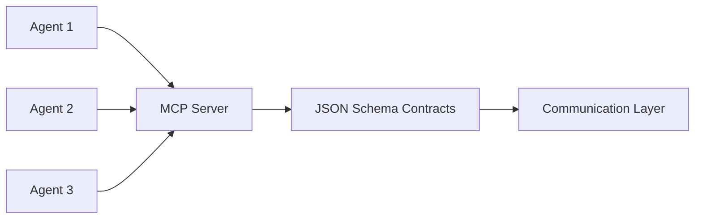

---

## Glossary

- **Agent**: TypeScript class that makes decisions and logs rationale
- **Orchestrator**: Agent that decides when to trigger viral loops
- **Session Intelligence**: System that analyzes practice results and generates challenges
- **Smart Link**: Short URL with attribution tracking (vt.ly/abc123)
- **FVM**: First Value Moment - completion of challenge
- **K-Factor**: Viral coefficient = (invites/user) × (conversion rate)

---

**Document Status:** Architecture Design Complete  
**Last Updated:** 2025-01-21  
**Next Review:** After MVP Implementation

